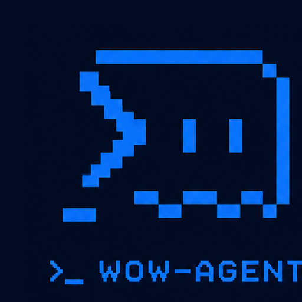

<div align="center">



# wow-agent

**Terminal Coding Agent for Everyone**

A simple, open, extensible terminal AI coding assistant

[](LICENSE)
[](https://www.python.org/)
[]()
[](https://uuzjw.github.io/wow-agent/)

**English** | [**简体中文**](README.zh-CN.md)

[Quick Start](#-quick-start) · [Features](#-core-features) · [Architecture](#-architecture-four-layer-design) · [Docs](https://uuzjw.github.io/wow-agent/)

</div>

---

## Why wow-agent?

Traditional AI coding loops look like this:

```
User → copy code → ask AI → edit yourself → ask again → infinite loop
```

wow-agent breaks the loop and joins your **real** workflow:

```
Give a goal → AI plans → tools execute → verify → done
```

It is not a chat toy — it is an **AI pair programmer that works inside real codebases**.

---

## Why choose wow-agent?

| Core difference | Traditional tools | wow-agent |
|----------------|-------------------|-----------|
| **Model freedom** | Locked to one vendor/model | **Any OpenAI-compatible API** + local models (Ollama / LM Studio) |
| **Runtime** | Tied to a specific IDE / cloud | **Pure terminal**, local execution, full data control |
| **Architecture** | x86 only | **Native ARM64** (tested on Jetson Orin NX, edge-ready) |
| **Safety** | AI executes commands directly | **Triple safety**: network sandbox + egress guard + double confirm + one-click rollback |
| **Extensibility** | Closed ecosystem | **MCP ecosystem** + custom tools + sub-agents |

> **In one sentence**: wow-agent gives you model choice, environment control, and safety decisions.

---

## Architecture: four-layer design

```
┌─────────────────────────────────────────────────────┐
│  Layer 1: Agent Brain                               │
│  ├─ task planning · state machine · sub-agents      │
└─────────────────────────────────────────────────────┘
                            ↓
┌─────────────────────────────────────────────────────┐
│  Layer 2: Developer Tools                           │
│  ├─ file CRUD / diff / undo / code index            │
└─────────────────────────────────────────────────────┘
                            ↓
┌─────────────────────────────────────────────────────┐
│  Layer 3: Model Ecosystem                           │
│  ├─ cloud: DeepSeek / Qwen / OpenAI / Gemini / ...  │
│  └─ local: Ollama / LM Studio                       │
└─────────────────────────────────────────────────────┘
                            ↓
┌─────────────────────────────────────────────────────┐
│  Layer 4: Safety System                             │
│  ├─ sandbox · egress guard · confirm · rollback     │
└─────────────────────────────────────────────────────┘
```

| Layer | Capability | Key tech |
|-------|-----------|----------|
| **Agent Brain** | task decomposition, state machine, sub-agents | `planning → executing → verifying → done/failed` |
| **Dev Tools** | file ops, diff/undo, code index | AST Python symbol table, incremental index, diff visualization |
| **Model Eco** | unified cloud/local access | 16+ providers + Ollama/LM Studio, `/model` fetches lists online |
| **Safety** | sandbox / egress guard / confirm / rollback | `unshare -n` isolation, egress patterns, `/undo` |

---

## 🚀 Quick Start

### Install (requires [uv](https://docs.astral.sh/uv/))

```bash
# Ubuntu / Debian / WSL
cd wow-agent && curl -LsSf https://astral.sh/uv/install.sh | sh && uv sync && uv run wow

# Windows (PowerShell, experimental)
cd wow-agent; irm https://astral.sh/uv/install.ps1 | iex
$env:Path += ";$env:USERPROFILE\.local\bin"
uv sync; uv run wow
```

Subsequent launches:

```bash
uv run wow        # or .venv/bin/wow
```

> First launch walks you through provider + API key setup, saved to `~/.wow-agent.env` (mode 600).

---

## ✨ Core Features

### 🤖 Agent Brain
- **Task tree + state machine**: auto-decomposes multi-step tasks, `planning → executing → verifying → done/failed`
- **Sub-agents**: clean-context code research that returns only conclusions; `/review` three-level code review
- **State machine**: `planning → executing → verifying → done/failed` automatic transitions

### 🛠 Developer Tools
- **File operations**: read / write / edit / delete / search; `code_index` builds a Python symbol table in one scan
- **Diff & Undo**: colored diff visualization, single-step `/undo`, full-task rollback on failure, snapshots survive restarts
- **Code index**: AST-parsed Python symbols, incremental updates — query the index before reading files

### 🤝 Model Ecosystem

| Type | Supported |
|------|-----------|
| Cloud | DeepSeek / Qwen / Kimi / GLM / SiliconFlow / Doubao / Hunyuan / MiniMax / OpenRouter / Groq / Mistral / Grok / OpenAI / Gemini / OpenCode Zen |
| Local | Ollama / LM Studio (no API key needed) |
| Free tier | OpenCode Zen free tier (includes ox alpha `x-preview-f-free`) |

### 🛡 Safety System
- **Network sandbox**: `unshare -n` network namespace isolation, falls back to proxy blackhole
- **Egress guard**: auto-blocks `curl POST` / `scp` / `git push` / `npm publish` etc.
- **Double confirm**: `rm -rf /`, `mkfs`, `dd`, fork bombs, `shutdown`, `chmod -R 777 /` require typed confirmation
- **One-click rollback**: `/undo` reverts a single step; failed tasks roll back entirely

---

## ⚙️ Configuration

Config file: `~/.wow-agent.env` (mode 600)

```bash
WOW_API_KEY=            # API key
WOW_BASE_URL=           # API base URL
WOW_MODEL=              # model id
WOW_SAFE_MODE=1         # 0 disables sandbox
WOW_MAX_ITER=40         # max iterations per task
WOW_AUTO_COMPACT=55000  # auto-compact threshold
WOW_LANGUAGE=en         # en/zh, default en
WOW_MODEL_CTX=128000    # model context length (for estimation)
WOW_CELL_ASPECT=2.0     # terminal cell aspect (logo scaling)
WOW_UPLOAD_GUARD=1      # egress guard switch
```

MCP servers: `~/.wow-agent/mcp.json`

```json
{
  "servers": {
    "fs": {"command": "npx", "args": ["-y", "@modelcontextprotocol/server-fs", "/tmp"]}
  }
}
```

---

## 💡 Usage

```text
$ wow
Enter auto mode? y/N    # y = skip step-by-step confirms (dangerous/egress still require approval)
> Help me understand this project structure
```

Interaction basics:
- `!<command>`: run shell directly without the model (e.g. `!git status`)
- `/`: fuzzy command completion, `/help` lists everything

| Command | Description |
|---------|-------------|
| `/model` | provider/model wizard; `/model <id>` quick switch |
| `/status` | session status: context, task progress, undoable changes |
| `/compact [hint]` | compress history manually (auto-triggers past threshold) |
| `/mem save/use/rm/list/new` | long-term memory |
| `/resume` | restore a previous session |
| `/undo` | revert last change; full rollback on task failure |
| `/review [path]` | read-only review: 🔴 high risk / 🟡 suggestion / 🟢 polish |
| `/language [en\|zh]` | switch language (default en, interactive menu) |
| `/safe` | toggle safe mode |
| `/clear` `/exit` | clear conversation / quit |

---

## 📚 Documentation

Full bilingual documentation is online: **[uuzjw.github.io/wow-agent](https://uuzjw.github.io/wow-agent/)**

- [Guide](https://uuzjw.github.io/wow-agent/guide/) — intro, quick start, commands
- [Architecture](https://uuzjw.github.io/wow-agent/architecture/) — state machine, sub-agents, code indexer
- [Tools](https://uuzjw.github.io/wow-agent/tools/) — file ops, diff/undo, MCP
- [Safety](https://uuzjw.github.io/wow-agent/safety/) — sandbox, egress guard, rollback
- [中文文档](https://uuzjw.github.io/wow-agent/zh/home/)

---

## 🧪 Development & Testing

```bash
uv sync                      # install dependencies
uv run python tests_smoke.py # smoke tests (offline)
uv run python tests_e2e.py   # e2e simulation (fake LLM, offline)
```

---

## 🤝 Contributing

All kinds of contributions are welcome!

- 🌐 **New model/provider adapters** — extend `PROVIDERS` in `config.py`
- 🎨 **UI/UX improvements** — `ui.py` / `tui.py` (if revived)
- 🔧 **New tools** — extend `TOOLS_SCHEMA` + `execute` in `tools.py`
- 🐛 **Bug fixes / docs** — Issues / PRs welcome

Please make the tests pass before submitting:

```bash
uv run python tests_smoke.py
uv run python tests_e2e.py
```

---

## License

[MIT](LICENSE) © uuzjw

> **Independently developed** — unrelated to other open-source projects with the same name.
> Please report issues at [GitHub Issues](https://github.com/uuzjw/wow-agent/issues).

<div align="center">
<sub>English | <a href="README.zh-CN.md">简体中文</a></sub>
</div>
